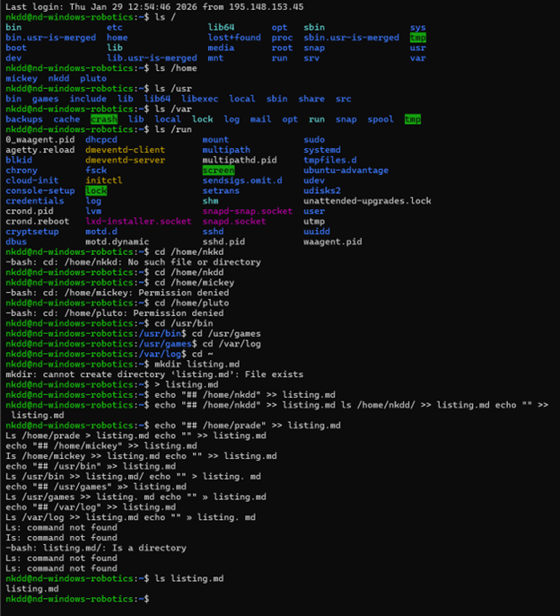

# **<ins> Assignment No: 0.</ins>**
Virtual Machine is a software based emulation of a physical computer that runs its own operating system and applications.

* Virtual machines run on hypervisors that allocate physical resources for example CPU, memory and storage to each guest OS.

* Enables rapid provisioning, scaling and isolation of workloads.

* Ideal for testing Linux environments without dedicated hardware.

## What Is a Cloud Platform ?
Cloud Platform: is an online environment that provides infrastructure, tools and services for developing and managing applications over the internet.

***Key characteristics :***

* ***Scalability*** – resources can be expanded or reduced on demand.

* ***Accessibility*** – services reachable from anywhere with an Internet connection.

* ***Flexibility*** – supports multiple operating systems, languages, and frameworks.

## Benefits of Cloud Platforms.

* ***Reduced hardware costs*** – no need to purchase, maintain, or upgrade physical servers.

* ***Rapid scaling*** – resources can be increased or decreased instantly to match demand.

* ***High availability*** – built‑in redundancy and failover mechanisms.

## Provider Services Offered.

| Provider | Service Portfolio | Market Position |
|---------|------------------|-----------------|
| Amazon Web Services (AWS) | IaaS, PaaS, SaaS | Leading provider |
| Microsoft Azure | IaaS, PaaS | Strong growth |
| Google Cloud Platform (GCP) | IaaS, PaaS | Innovative features |
| IBM Cloud | IaaS, PaaS, SaaS | Enterprise focus |

## Step 1: Azure Account with a 100$ Credit. 
I first created an account at [Azure Portal](https://portal.azure.com/) using my HAMK student credentials. Then i activated my Azure for students to be eligble for the free  100$ credit. 

## Step 2: Create Resource Group 
I made a resource group named Linux management-1 in Sweden Central server. 

## Created the Virtual Machine
Setup used :

* Image: Ubuntu Server 24.04 LTS
* Size: Standard D2s v3
* Name: prade-ubuntu-LinuxLearning
* Authentication: SSH key
* Allowed SSH from my IP

  Then the Virtual Machine came to life fully operational.

  This is an overview of the Virtual Machine:

## Step 4: Connected with SSH using PuTTY
I downloaded PuTTY from the official site.
Took the public IP from Azure → opened PuTTY → entered IP + username + loaded my SSH key.

This is how it looked like after:

## Step 5: Connected to the terminal
Now that all the necessary steps has been taken into consideration,I can now run my Virtual Machine in my terminal. With the lecture's guidance, I also created a shortcut key so that i can access the Virtual Machine in the terminal smoothly when needed.

## **<ins> Assignment No: 2.</ins>**

In this assignment, we are to select five level 2 directories and save their contents in one file with the name <mark>list.md</mark> We were also given example of level 2 directories to help us understand the task better.

#### Bellow is a visual representation of my code.

## **<ins> Assignment No: 3.</ins>**
The goal of Assignment 3 was to create users to test file permission access.

## Step 1: Create the Tupu user using the adduser script. 

In this step, we  use adduser script and add user tupu 
> sudo adduser tupu 

## Step 2: Create the Lupu user using the useradd command. Try to create a user profile, home directory, and user group similar to Tupu. 

In this step, we were told to create <ins>lupu</ins> user using <ins>useradd</ins> command.

> useradd: group 'lupu' does not exist

I then used  used <ins>-g</ins> because it is a primary group and I have already add lupu in a group.

>sudo groupadd lupu

>sudo useradd -m -d /home/lupu -s /bin/bash -g lupu lupu

## Step 3: Create the Hupu system user with the login shell set to /bin/false.

In this step,we are creating a hupu system using /bin/false.

> sudo useradd --system --shell /bin/false hupu

## Step 4: Add the users Tupu and Lupu to the sudo users.

We are provided with two add the users accordingly which i chose the second option.  

Option one: 
> sudo visudo
 
 Also: 

 > Add the following lines:
tupu ALL=(ALL:ALL) ALL
lupu ALL=(ALL:ALL) ALL

Option two: 

> sudo usermod -aG sudo tupu

> sudo usermod -aG sudo lupu

## Step 5: Create a directory /opt/projekti and add both users (Tupu and Lupu) as owners. Only Tupu and Lupu should have access to list files in the directory, read, and modify them.

I started by creating a group for both users. 

> sudo groupadd projekti

Added both users to the group. 

> sudo usermod -aG projekti tupu

> sudo usermod -aG projekti lupu

I then created the projekti directory. 

> sudo mkdir /opt/projekti

I assigned group ownership. 

> sudo chown root:projekti /opt/projekti

I also setted the directory permissions. 

> sudo chmod 770 /opt/projekti

Finally the addmin can access the groups whilst others are exempted from access.

In this stage, the setgid bit ensures all newly created files and directories inherit the <ins>projekti</ins> group.

> sudo chmod g+s /opt/projekti

## Step 6: Premisssion Testing

In this stage, I run a testing program. 

* Test as tupu

> su - tupu
cd /opt/projekti
touch test_tupup.txt
ls -l 

* Test as lupu

> su - lupu
cd /opt/projekti
echo "hello" >> test_tupu.txt
touch test_lupu.txt
ls -l 

* Test as hupu

The hupu had an unauthorised access so it showed access denied. 

> su - hupu
cd /opy/projekti  

Visual representation of the codes: 

